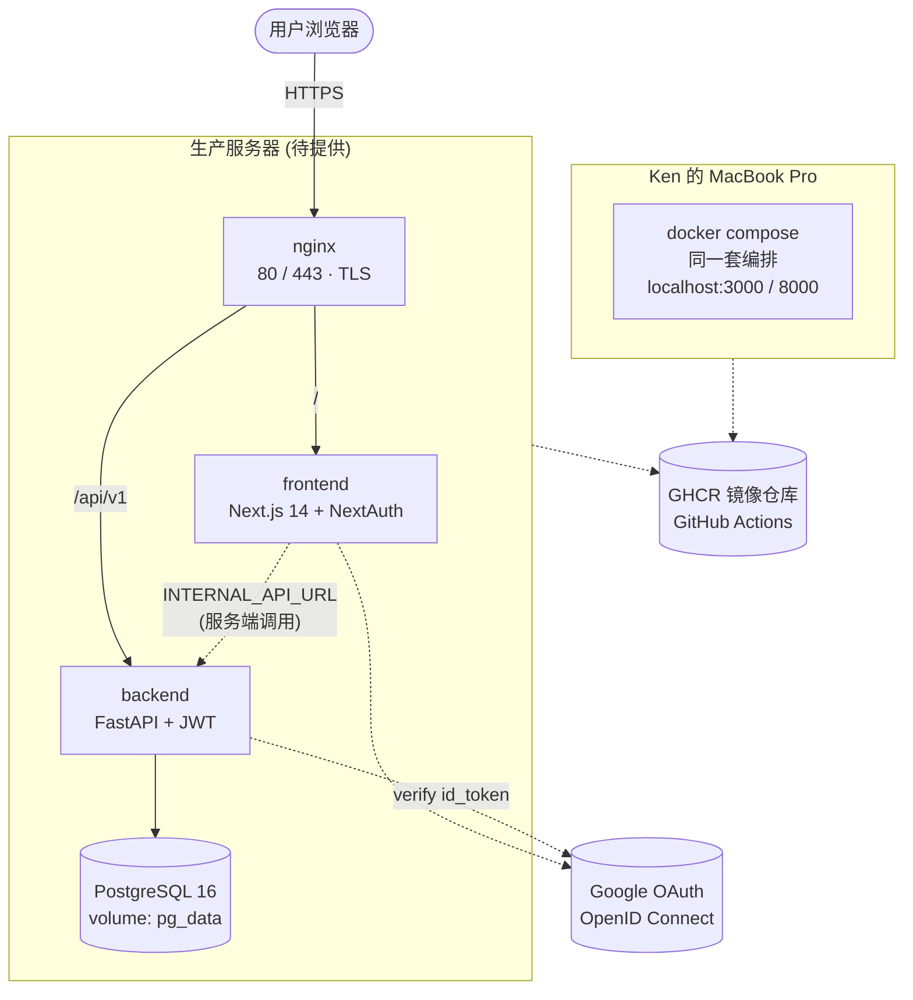
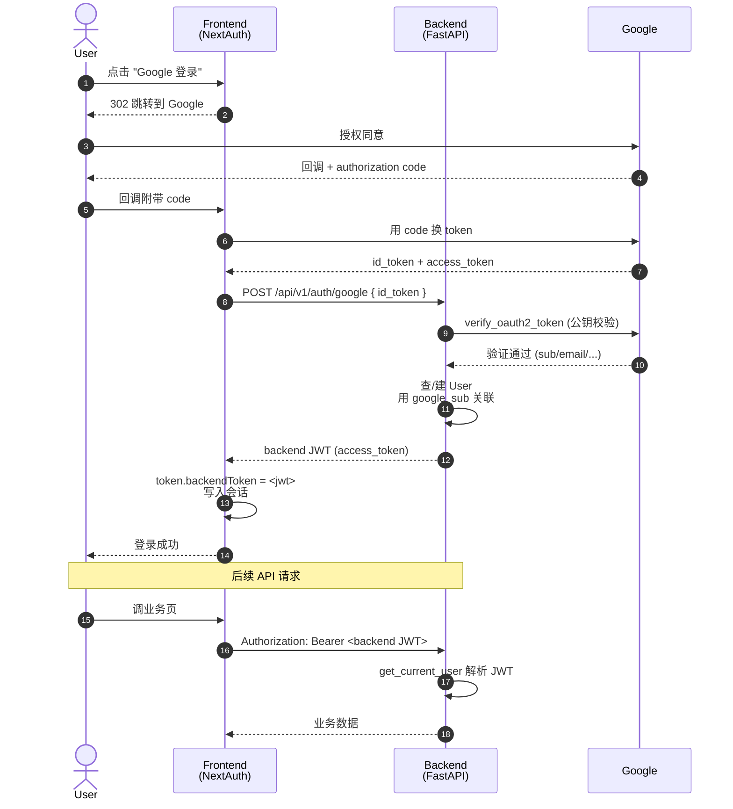
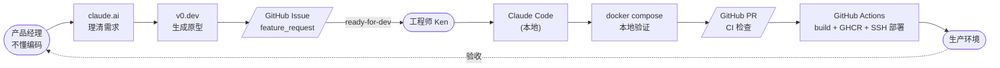
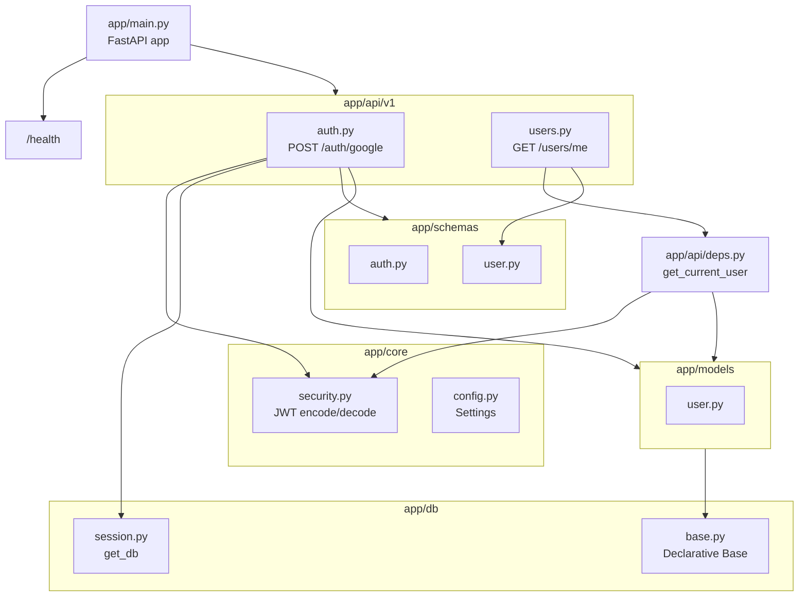
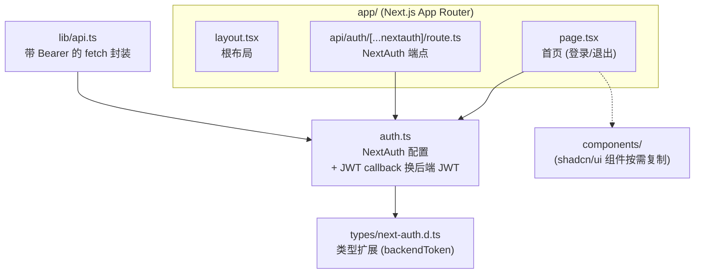

# 架构图

## 1. 运行时架构

```mermaid
flowchart TB
    User([用户浏览器])

    subgraph Prod["生产服务器 (待提供)"]
        Nginx["nginx<br/>80 / 443 · TLS"]
        FE["frontend<br/>Next.js 14 + NextAuth"]
        BE["backend<br/>FastAPI + JWT"]
        DB[("PostgreSQL 16<br/>volume: pg_data")]

        Nginx -- "/" --> FE
        Nginx -- "/api/v1" --> BE
        FE -.->|"INTERNAL_API_URL<br/>(服务端调用)"| BE
        BE --> DB
    end

    subgraph Dev["Ken 的 MacBook Pro"]
        DevCompose["docker compose<br/>同一套编排<br/>localhost:3000 / 8000"]
    end

    Google[("Google OAuth<br/>OpenID Connect")]
    GHCR[("GHCR 镜像仓库<br/>GitHub Actions")]

    User -->|HTTPS| Nginx
    FE -.-> Google
    BE -.->|verify id_token| Google
    Prod -.-> GHCR
    Dev -.-> GHCR
```

## 2. Google 登录 → 后端 JWT 时序

```mermaid
sequenceDiagram
    autonumber
    actor U as User
    participant FE as Frontend<br/>(NextAuth)
    participant BE as Backend<br/>(FastAPI)
    participant G as Google

    U->>FE: 点击 "Google 登录"
    FE-->>U: 302 跳转到 Google
    U->>G: 授权同意
    G-->>U: 回调 + authorization code
    U->>FE: 回调附带 code
    FE->>G: 用 code 换 token
    G-->>FE: id_token + access_token
    FE->>BE: POST /api/v1/auth/google { id_token }
    BE->>G: verify_oauth2_token (公钥校验)
    G-->>BE: 验证通过 (sub/email/...)
    BE->>BE: 查/建 User<br/>用 google_sub 关联
    BE-->>FE: backend JWT (access_token)
    FE->>FE: token.backendToken = <jwt><br/>写入会话
    FE-->>U: 登录成功

    Note over U,BE: 后续 API 请求
    U->>FE: 调业务页
    FE->>BE: Authorization: Bearer <backend JWT>
    BE->>BE: get_current_user 解析 JWT
    BE-->>FE: 业务数据
```

## 3. 协作 & 交付流程

```mermaid
flowchart LR
    PM([产品经理<br/>不懂编码])
    AI1["claude.ai<br/>理清需求"]
    AI2["v0.dev<br/>生成原型"]
    Issue[/"GitHub Issue<br/>feature_request"/]

    PM --> AI1 --> AI2 --> Issue

    Eng([工程师 Ken])
    CC["Claude Code<br/>(本地)"]
    Compose["docker compose<br/>本地验证"]
    PR[/"GitHub PR<br/>CI 检查"/]
    CI["GitHub Actions<br/>build + GHCR + SSH 部署"]
    ProdEnv([生产环境])

    Issue -- "ready-for-dev" --> Eng
    Eng --> CC --> Compose --> PR --> CI --> ProdEnv
    ProdEnv -.->|验收| PM
```

## 4. 后端模块（包结构）

```mermaid
flowchart TB
    Main["app/main.py<br/>FastAPI app"]
    Main --> APIv1
    Main --> Health["/health"]

    subgraph APIv1["app/api/v1"]
        Auth["auth.py<br/>POST /auth/google"]
        Users["users.py<br/>GET /users/me"]
    end

    Deps["app/api/deps.py<br/>get_current_user"]
    Auth --> Schemas
    Users --> Deps
    Deps --> Models
    Deps --> Security

    subgraph Core["app/core"]
        Config["config.py<br/>Settings"]
        Security["security.py<br/>JWT encode/decode"]
    end

    subgraph DB["app/db"]
        Session["session.py<br/>get_db"]
        Base["base.py<br/>Declarative Base"]
    end

    subgraph Models["app/models"]
        UserM["user.py"]
    end

    subgraph Schemas["app/schemas"]
        AuthS["auth.py"]
        UserS["user.py"]
    end

    Auth --> Security
    Auth --> Models
    Auth --> Session
    Users --> UserS
    Models --> Base
```

## 5. 前端目录映射

```mermaid
flowchart TB
    subgraph App["app/ (Next.js App Router)"]
        Layout["layout.tsx<br/>根布局"]
        Page["page.tsx<br/>首页 (登录/退出)"]
        NA["api/auth/[...nextauth]/route.ts<br/>NextAuth 端点"]
    end

    Auth["auth.ts<br/>NextAuth 配置<br/>+ JWT callback 换后端 JWT"]
    Lib["lib/api.ts<br/>带 Bearer 的 fetch 封装"]
    Comp["components/<br/>(shadcn/ui 组件按需复制)"]
    Types["types/next-auth.d.ts<br/>类型扩展 (backendToken)"]

    Page --> Auth
    NA --> Auth
    Lib --> Auth
    Page -.-> Comp
    Auth --> Types
```
